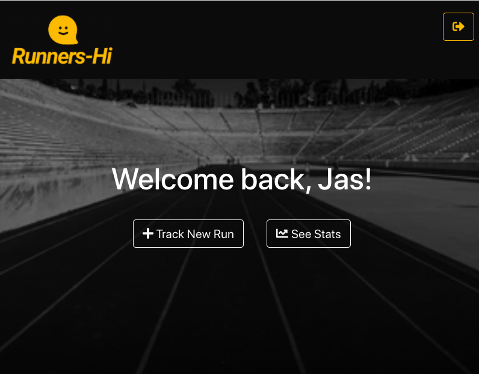

# [Runner's-Hi](#)

> Runner’s-Hi tracks the one thing your current running app doesn’t: The effect of exercise on your emotional well-being. 

## The Concept

Runner's-Hi is a single-page web application targeted toward intermediate noncompetetive runners who may already be using an app like Nike Run Club or Strava, but who are motivated by more than speed, distance, and calories. Runner's-Hi makes the ordinarily prosaic wisdom that "you're always glad you ran" into something truly quantifiable. Users are given averages and graphs to visualize the relational data between their mood before running and their mood after. 

## Features

* A two part form, utilizing full-CRUD, that allows user to feed the database with their pre and post-run stats
* A note form where users can record insights about their run
* An clean, intuitive interface that makes logging info fun and easy
* A chart that allows users to see relational data about their run

## Run the App

Go for it! [It's deployed here!](https://runners-hi.herokuapp.com/)
I would recommend logging in as a user with a few runs under her belt to enjoy full-functionality. 
The graph only appears after you've logged 3 runs because... what's a line-graph with 1 point on it anyway?
username: jk@jk.com
password: jk

## Screenshots

|  |
| :---: |
| Homepage for existing users|

|  |
| :---: |
| Runner's Stats|

|  |
| :---: |
| Part 1 of Runner's mood form |

## A guided workflow

1. Register a new account. **Do not use any sensitive credentials. This is not a secure application!** 
1. As a new user, click the affordance to log a new run.
1. Choose from the dropdown what type of run you will embark on and choose from 1-10 what your starting mood is like.
1. When you've completed your run, click Completed in the pop up screen.
1. Great! You've made it to the post-run check-in. Log any info, inspiration, physical notes, or insights in the text box and choose your mood now that you've gone for a run.
1. Log it
1. Once you've logged 3 runs, a graph will appear that shows the relational data between your pre-run mood and post-run mood over time.
    * It will also show you, on average, how much exercise has changed your mood.
1. Feel free to keep logging runs or sign out.
## Technologies Used

This application was built using the [React](https://github.com/) JavaScript library, and was bootstrapped with [create-react-app](https://github.com/facebook/create-react-app). Other packages used in the production site outside of those provided by create-react-app are [charts.js](https://www.chartjs.org/docs/latest/) and [react-router-dom](https://www.npmjs.com/package/react-router-dom).  

The API server is powered by [json-server](https://www.npmjs.com/package/json-server).  

All styling was a combination of ReactBootstrap and vanilla CSS3.

## Planning Resources

Below are the planning documents and resources I created before I began implementing this project. 
* [ERD](https://dbdiagram.io/d/5fc906b13a78976d7b7e67ce)
* [Wireframe, File-Structure, Component Chart](https://docs.google.com/document/d/1j3vc-rzSNOSqB5WIqg_LNC5Thenr0xkbiIe8legOpkY/edit?usp=sharing)

## Author

Jasmin Kaset - [GitHub](https://github.com/jkaset), [LinkedIn](https://www.linkedin.com/in/jkaset/) 
